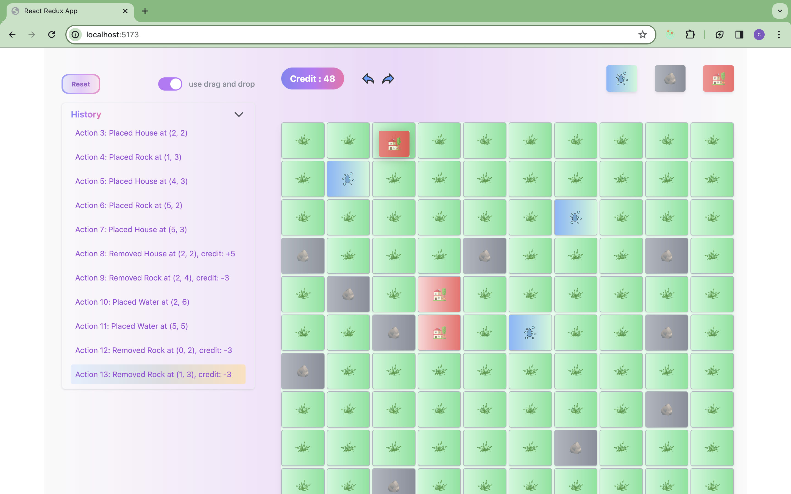

# terrain builder App

Terrain Builder App complete with:

- Possibility to activate or not the drag and drop functionality through the switch button
- drag and drop to place or remove items
- normal click to place and click to delete current tile
- view of history and possibility to view that grid state
- reset button to reset back the board
- undo and redo functionality

## Screenshots

- Start frontend :
- Install pakages `yarn install`  then run  `yarn dev`

## Présentation

Le but est de créer une petite application de "terrain builder" fonctionnant uniquement côté client (pas besoin de base de données / d’API), une interface 2D où tu peux placer des éléments (rocher, eau, maison) sur une grille.

Tu disposes d’un budget (disons 100 crédits), et certaines actions dépenseront ou ajouteront du crédit à ton budget.

Les coûts et restrictions sont les suivants :

- Placer une maison coûte 10 / Supprimer une maison te rapporte 5
- Placer / Supprimer un rocher coûte 3
- Placer un bloc eau coûte 3 / On ne peut pas supprimer un bloc eau
- Si on supprime un bloc maison ou rocher, cela devient un bloc “herbe” par défaut
- On ne peut que placer un bloc rocher / eau / maison sur un bloc herbe
  Enfin, en bonus, il serait intéressant de pouvoir gérer un historique de tes actions :
- On peut faire un “Précédent / Suivant” pour annuler / refaire les actions faites (actions de placement / suppression de blocs)
- On peut voir un log / liste des actions faites
- Au clic sur une des actions de ce log, cela replace la grille / le budget dans l’état
  où ils étaient après cette action
  Pour te faire une idée du résultat attendu :
- A l’ouverture de l’app, on voit (positionnements et design libres) : - une grille de 10 x 10 cases, toutes de type “herbe” à l’exception de
  certaines sélectionnées aléatoirement, qui sont de type “rocher” - le budget en cours - un menu, on peut sélectionner un type de bloc à placer (maison, rocher,
  eau) : une fois ce type sélectionné, les clics sur les cases de la grille placeront ce bloc, sauf si la case en question est déjà occupée par un autre de ces 3 types, et cela coûtera du budget
- Si je clique sur une des cases, je vois des infos la concernant (type, position X;Y sur la grille) s’afficher dans un encart d’info. Dans cet encart, je vois aussi un bouton d’action : “Supprimer le bloc” (avec le crédit que cela vous coûtera /
  remboursera)
- Je ne peux pas placer de bloc si je n’ai pas le budget nécessaire
- (Bonus) Historique des actions : j’ai une section dans laquelle je vois l’historique de mes actions, et la
  possibilité de cliquer sur celles-ci pour y revenir, ainsi que 2 boutons Suivant /
  Précédent
- Tous les petits “plus” visuels sont les bienvenus : toaster d’erreur si tu n’as pas le
  budget pour placer / supprimer tel bloc ; animation sur l’update du budget ; scroll
  sur les actions de l’historique ; etc.
